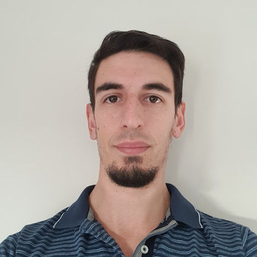

```{r setup, include=FALSE}
knitr::opts_chunk$set(echo = TRUE)
```

## Curriculum Vitae

### Datos Personales



### Formación
| Desde | Hasta | Título Obtenido | Institución | 
|:-------:|:------:|:-----------|:---------:| 
| 2010 | 2017| Ingeniero Químico| Facultad de Ciencias Exactas Físicas y Naturales– Universidad Nacional de Córdoba 


### Experiencia laboral

| Desde    | Hasta      | Puesto - Lugar      | Tareas                                                                 |
|:--------:|:----------:|:--------------------|:-----------------------------------------------------------------------| 
| Dic 2023 | Actualidad | Focal Point - Calfrac Well Services | Enlace entre el cliente y la compañía de servicios, seguimiento y actualización de Órdenes de Servicio y Pedidos de Empresa, seguimiento de actividad de fractura, participación en reuniones de status diario y visitas al cliente, colaboración activa con Account Manager y Jefa de Base, desarrollo de tableros en Power BI para seguimiento gerencial|
| Feb 2023 | Actualidad | Ingeniero de Campo – Fractura - Calfrac Well Services | Diseño y ejecución de Fracturas Hidráulicas en yacimientos convencionales, Supervisión de operaciones, Consenso de diseños con clientes, Validación de propiedades fisicoquímicas de fluidos de fractura en campo y laboratorio|
| May 2022 | Ago 2022 | Jefe de Unidad – Montaje VU - Renault Argentina | Supervisión, liderazgo y coordinación de una unidad de trabajo de 18 colaboradores, reportes de producción, gestión de personal a cargo, seguimiento de indicadores de calidad, uso de herramientas de calidad para el seguimiento de desvíos.|
| Feb 2022 | May 2022 | Responsable de laboratorio - Capemi | Supervisión, liderazgo y coordinación de inspectores de laboratorio de producción de repuestos de goma y goma-metal, controles de calidad de mezclas y productos terminados, control de efluentes de fosfatizado. Responsable de presentación de documentación ante RENPRE.|
| Dic 2019 | May 2021 | Ingeniero de Campo – Fractura - Calfrac Well Services | Diseño y ejecución de Fracturas Hidráulicas en yacimientos convencionales, Supervisión de operaciones, Consenso de diseños con clientes, Validación de propiedades fisicoquímicas de fluidos de fractura en campo y laboratorio|
| Sep 2017 | Dic 2019 | Ingeniero de Campo – Fractura - Schlumberger | Diseño y ejecución de Fractura Hidráulica en yacimientos convencionales y no convencionales, Supervisión de operaciones, Líder de equipo HSE, Consenso de diseños con clientes, Validación de propiedades fisicoquímicas de fluidos de fractura en campo y laboratorio|

### Idiomas
| Idioma  | Nivel    | Detalle                                                                                                         |
|---------|----------|-----------------------------------------------------------------------------------------------------------------|
| Inglés  | Avanzado | C1 (sin certificar).  First Certificate in English rendido (Nivel B2 según el Marco Común Europeo de Referencia para las Lenguas) |
| Alemán  | Avanzado | Deutsches Sprachdiplom der Kulturministerkonferenz II (Nivel B2/C1 según el Marco Común Europeo de Referencia para las Lenguas) |
| Italiano| Básico   | Segundo año completo en el Istituto Italiano di Cultura Córdoba

### Contacto

- Correo: <leonardo.ortega992@gmail.com>
- Cel: ***3546475929***
- Dirección: Paraná 550, Piso 13, Depto “I”,
Córdoba, Córdoba, Argentina
